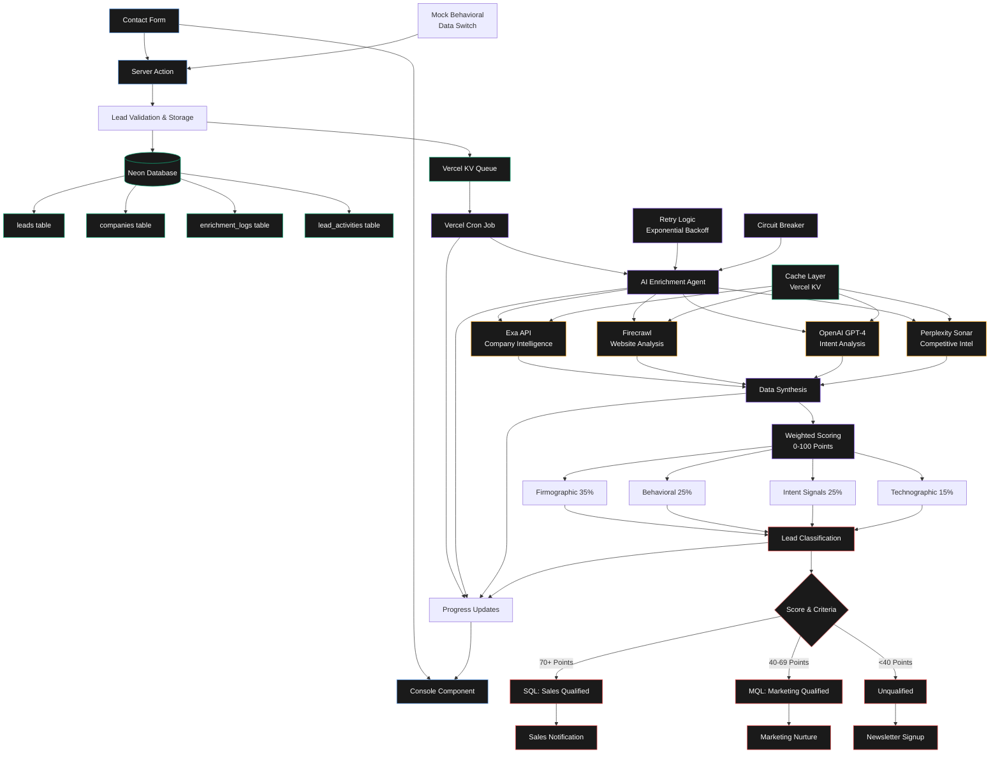

# AI-Powered Lead Enrichment System Architecture

## System Overview

This chart illustrates the complete architecture of the POC lead enrichment and scoring system, showing the data flow from initial contact form submission through AI-powered enrichment to final lead classification and routing.

## Architecture Diagram

## Key Components

### 1. User Interface (Blue)
- **Contact Form**: Initial lead capture interface
- **Server Action**: Next.js server action for form processing
- **Console Component**: POC demonstration interface showing real-time progress

### 2. Database Layer (Green)
- **Neon Database**: PostgreSQL database with Drizzle ORM
- **Core Tables**: leads, companies, enrichment_logs, lead_activities
- **Vercel KV**: Queue system and caching layer

### 3. External APIs (Orange)
- **Exa API**: Company intelligence and recent signals
- **Firecrawl**: Website analysis and tech stack detection
- **OpenAI GPT-4**: Intent analysis and data synthesis
- **Perplexity Sonar**: Competitive intelligence and market data

### 4. Processing Layer (Purple)
- **Vercel Cron**: Background job processing
- **AI Enrichment Agent**: Orchestrates multiple API calls
- **Data Synthesis**: Combines and analyzes enriched data
- **Weighted Scoring**: Multi-factor scoring algorithm

### 5. Classification & Routing (Red)
- **Lead Classification**: SQL/MQL/UNQUALIFIED determination
- **Routing Logic**: Automated lead assignment based on score
- **Actions**: Sales notifications, marketing sequences, newsletter signup

## Data Flow

1. **Lead Capture**: User submits contact form
2. **Immediate Storage**: Lead data stored in database, job queued
3. **Background Enrichment**: AI agent processes lead using multiple APIs
4. **Data Synthesis**: Combined data analysis and scoring
5. **Classification**: Lead categorized based on score and criteria
6. **Routing**: Automatic assignment to appropriate sales/marketing flow
7. **Console Updates**: Real-time progress shown in POC interface

## POC-Specific Features

- **Mock Behavioral Data**: Switch to inject sample engagement data
- **Console Component**: Live demonstration of enrichment process
- **Simplified Architecture**: Focused on core functionality for proof of concept
- **Cost Optimization**: Intelligent caching and rate limiting built-in

## Performance Characteristics

- **Immediate Response**: Lead captured in <100ms
- **Asynchronous Processing**: Enrichment runs in background
- **Fault Tolerance**: Circuit breakers and retry logic
- **Scalable Design**: Queue-based processing with caching
